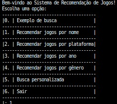
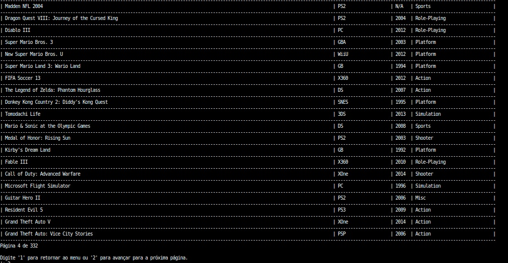

# Game Recommendation

**Disciplina**: FGA0210 - PARADIGMAS DE PROGRAMAÇÃO - T01 <br>
**Nro do Grupo (de acordo com a Planilha de Divisão dos Grupos)**: G5<br>
**Paradigma**: Lógico <br>

## Alunos
|Matrícula | Aluno |
| -- | -- |
| 19/0094486  | Pedro Henrique Nogueira |
| 19/0088257  | Guilherme Keyti Cabral Kishimoto|
| 19/0093480  | Matheus Soares Arruda|
| 19/0084642  | Arthur Taylor|
| 19/0088745  | Iago Cabral|
| 19/0042532  | Felipe Alef|
| 20/0042360  | Nicolas Roberto|
| 19/0096071  | Thiago Oliveira|
| 20/2063346  | José Filipi Brito|  

## Sobre 
O projeto fundamenta-se no uso de um CSV disponibilizado pela Kaggle ([Video Game Sales](https://www.kaggle.com/datasets/gregorut/videogamesales)) onde a partir dele ocorre a semeação dos Fatos do Prolog, dessa forma possibilitando uma vasta gama de perguntas e recomendações para o usuário. O objetivo é que o usuário seja capaz de descobrir baseado na sua plataforma preferida, data e genêro, todos os jogos que são de sua preferência. Outras pesquisas baseadas em nome também são possíveis.

## Screenshots
Adicione 2 ou mais screenshots do projeto em termos de interface e/ou funcionamento.



## Instalação 
**Linguagens**: Prolog<br>
**Tecnologias**: SWI-Prolog<br>

``` bash
sudo apt-get update
```
``` bash
sudo apt-get install swi-prolog
```

## Uso 
Para rodar nosso arquivo main.pl, basta fazer o seguinte:

``` bash
swipl
```

``` bash
? - consult("main.pl").
```

## Vídeo
Adicione 1 ou mais vídeos com a execução do projeto.
Procure: 
(i) Introduzir o projeto;
(ii) Mostrar passo a passo o código, explicando-o, e deixando claro o que é de terceiros, e o que é contribuição real da equipe;
(iii) Apresentar particularidades do Paradigma, da Linguagem, e das Tecnologias, e
(iV) Apresentar lições aprendidas, contribuições, pendências, e ideias para trabalhos futuros.
OBS: TODOS DEVEM PARTICIPAR, CONFERINDO PONTOS DE VISTA.
TEMPO: +/- 15min
## Participações
Apresente, brevemente, como cada membro do grupo contribuiu para o projeto.
|Nome do Membro | Contribuição | Significância da Contribuição para o Projeto (Excelente/Boa/Regular/Ruim/Nula) |
| -- | -- | -- |
| Matheus Soares | - Definição das estruturas do projeto.<br>- Semear banco de conhecimento prolog com CSV.<br>- Ajuda com sistema de filtro por nome. | Excelente |
| Pedro Henrique Nogueira |  | Excelente |
| Guilherme Keyti Cabral Kishimoto |  | Excelente |
| Arthur Taylor |  | Excelente |
| Iago Cabral | | Excelente |
| Felipe Alef | Sistema de filtro por publicadora doa jogos | Excelente |
| Nicolas Roberto |  | Excelente |
|  Thiago Oliveira |   | Excelente |
|  José Filipi Brito |  | Excelente |
## Outros 
### Lições Aprendidas
- Transição do Projeto: Tivemos inicialmente dificuldades na criação de um sistema de recomendação de jogos em Prolog devido às complexidades do paradigma lógico e da lógica de inferência.
- Desafios com Recomendações: A tentativa inicial de construir um sistema de recomendação de jogos revelou-se mais complexa do que o esperado. As recomendações personalizadas exigem uma compreensão profunda das preferências dos usuários e da lógica subjacente, e enfrentamos desafios na obtenção de resultados satisfatórios.

### Contribuições
- Implementação do Aplicativo de Busca: Conseguimos criar com sucesso um aplicativo de busca que permite aos usuários procurar e acessar informações sobre jogos de forma eficaz. Isso proporcionou uma experiência de usuário útil, apesar das dificuldades iniciais com o sistema de recomendação.
- Uso Eficiente dos Dados do Kaggle: A capacidade de extrair e utilizar eficazmente dados do Kaggle foi uma das nossas contribuições mais significativas. Isso nos permitiu construir um aplicativo de busca com uma base de dados abrangente de jogos.

### Fragilidades
- Complexidade do Paradigma Lógico: A complexidade do paradigma lógico, em particular, a lógica de inferência em Prolog, apresentou desafios que inicialmente superaram nossa capacidade de implementar um sistema de recomendação de jogos.
- Dificuldades com Recomendações: Nossas tentativas iniciais de construir um sistema de recomendação de jogos não atingiram as expectativas de qualidade e precisão. A dificuldade em modelar a lógica das preferências do usuário foi um dos principais obstáculos.
- Rigor dos dados: O csv acaba forçando o Usuário a ser muito rígido no momento de passar os dados.

### Possíveis Melhorias
- Exploração de Outras Tecnologias: Considerar a possibilidade de explorar outras tecnologias para complementar o prolog na tarefa de fazer um sistemas de recomendação, ex: JS para um front-end.
- Feedback Contínuo dos Usuários: Independentemente do foco do aplicativo, coletar feedback dos usuários para ajustar e melhorar o aplicativo com base nas necessidades e preferências reais.
- Documentação e Transferência de Conhecimento: Documentar os aprendizados e as experiências adquiridas durante o projeto, a fim de facilitar a transferência de conhecimento para equipes futuras.
- User-Friendly: Uma boa melhora seria deixar o aplicativo mais amigável do ponto de vista do usuário.
- Filtro de nome: Este filtro está carregado com uma complexidade muito grande, talvez diminuir essa complexidade.

## Fontes
> Bos, P. (s.d.). Learn Prolog Now! Disponível em: [](http://www.let.rug.nl/bos/lpn//lpnpage.php?pageid=manuals)
